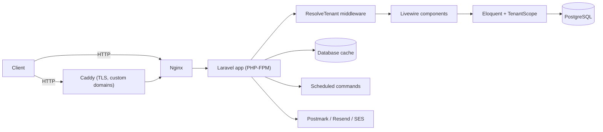

# Architecture

## Overview

Single Laravel 13 application, single PostgreSQL database, shared schema. Multi-tenancy is hand-rolled (no tenancy package): every tenant-owned row carries a `tenant_id`, and a per-request middleware resolves which tenant the current host belongs to. There is no separate API layer — Livewire components render server-side and talk to Eloquent models directly.

## Application Flow

1. **Request arrives** at Nginx (plain HTTP, port 8000) or Caddy (TLS, 80/443 — used once a tenant's custom domain/CNAME points here).
2. **`ResolveTenant` middleware** (global) inspects the host:
   - Verified custom domain (`domains` table) → resolves that tenant.
   - Else, subdomain of a `CENTRAL_DOMAINS` entry (`{slug}.{central}`) → resolves `Tenant` by slug.
   - Else, if the host itself is a central domain → no tenant (platform context).
   - Else → 404. Suspended tenants get a dedicated view; other inactive statuses 404 indistinguishably (avoids slug probing).
   - Resolved tenant is bound as `app('currentTenant')`, read via `App\Support\Tenancy`; Spatie's permission "team ID" is set to the tenant ID so role checks are implicitly tenant-scoped.
3. **`EnsureTenantResolved`** (route middleware alias `tenant`) guards tenant-only route groups; a platform staff member hitting a tenant route on a tenant domain is redirected to `platform.dashboard` instead of 404ing.
4. **`SetLocale`** middleware forces app locale for `admin/*`, `dashboard/*`, `settings/*`; storefront pages read `lang` from param/session/cookie.
5. Route resolves to a **Livewire full-page component**, which loads data through Eloquent models. Every tenant-owned model uses the `BelongsToTenant` trait, which registers a global `TenantScope` (`WHERE tenant_id = current tenant`) and auto-fills `tenant_id` on create.
6. Blade views render inside one of the layout shells (`app`, `platform`, `public`, `pos`, `auth`) depending on whether the route is tenant-admin, platform-console, storefront, or POS terminal.

## Frontend

- **Livewire 3** full-page components under `app/Livewire/{Admin,Platform,Pos,Dashboard,Settings}`, with Blade views under `resources/views/livewire/` mirroring the same structure 1:1.
- **Flux UI** (`livewire/flux`) is the component library (`<flux:button>`, `<flux:modal>`, `<flux:sidebar>`, etc.), with local overrides in `resources/views/flux/`.
- **Tailwind CSS 4**, CSS-first config entirely in `resources/css/app.css` (`@theme` block for fonts/colors/shadows) — no `tailwind.config.js`.
- Shared Blade component kits by area: `x-admin.*` (tenant backoffice), `x-platform.*` (platform console), `x-public.*` (storefront, ~120 components: navbars, heroes, product grids/cards, carts, checkouts), `x-pos.*`, `x-dashboard.*`, `x-website-settings.*`.
- Plain JS (`resources/js/`): Chart.js for dashboard metrics, SortableJS for drag-to-reorder (categories, navigation, dashboard cards, sections), Alpine-based Trix rich-text editor.
- Built with Vite (`npm run build`) into `public/build/`; **no Vite dev server runs in this deployment** — Nginx serves the compiled static assets, so any template change introducing new Tailwind classes requires a rebuild.

## Backend

- **Middleware**: `ResolveTenant`, `EnsureTenantResolved` (`tenant` alias), `SetLocale` — registered in `bootstrap/app.php`.
- **Auth**: Laravel Fortify (login, registration, password reset, 2FA), with custom `CreateNewUser` action — registration on the central domain creates a brand-new tenant, not a customer account.
- **Authorization**: `spatie/laravel-permission` in teams mode (`team_foreign_key = tenant_id`), roles/permissions seeded by `RolesPermissionsSeeder`. Coarse-grained Gates in `AppServiceProvider` (`access admin`, `access platform`, `access pos`, `impersonate tenants`, plus POS-specific gates) layered on top of fine-grained permission strings.
- **Service layer** (`app/Services/`): `PosSaleService` (cart → Order, stock lock/decrement), `PosRefundService` (reverse a sale, restock), `ShippingService` (cost from weight + city rate).
- **Observers** (`app/Observers/`): keep the inventory audit trail and denormalized stock counts in sync — `OrderObserver`, `ProductObserver`, `ProductAttributeObserver`, `ProductBatchObserver`, `WarehouseStockObserver`, all writing through `StockMovementContext`.
- **Notifications** (`app/Notifications/`): tenant lifecycle/billing (`WelcomeTenant`, `TenantSuspended`, `TenantReactivated`, `TrialEndingSoon`, `UpgradeRequestSubmitted/Approved/Rejected`) and `PosShiftClosedWithVariance`, delivered via `mail` + `database` channels.

## Database

PostgreSQL 18, single shared schema. Key groupings (see `database/migrations/`):

- **Tenancy**: `tenants`, `domains`, `plans`, `tenant_billing_events`, `platform_settings`
- **Catalog**: `categories`, `products`, `attributes`, `attribute_values`, `product_attributes`, `product_batches`
- **Orders**: `orders`, `order_items`, `order_status_histories`, `order_payments`, `order_refunds`
- **POS**: `pos_registers`, `pos_shifts`, `pos_cash_movements`, `pos_held_sales`, `customers`
- **Inventory**: `warehouses`, `warehouse_stocks`, `stock_movements`, `stock_transfers` (+items), `purchase_orders` (+items), `suppliers`, `cycle_counts` (+items)
- **Content/marketing**: `landing_page_sections`, `landing_pages`, `testimonials`, `navigation_items`, `navbar_components`, `coupons`, `shipping_settings`, `shipping_city_rates`, `cities`
- **Access**: `users`, Spatie `roles`/`permissions` tables (team-scoped), `admin_audit_logs`

Row-level isolation: `BelongsToTenant` trait + `TenantScope` global scope on every tenant-owned model; `scopeWithoutTenantScope()` is the explicit escape hatch for platform-side cross-tenant queries.

## Authentication

Laravel Fortify handles login, registration, password reset, email verification, and two-factor auth (`TwoFactorAuthenticatable` on `User`, UI in `app/Livewire/Settings/TwoFactor.php`). Platform staff are identified by `tenant_id === null` on their `User` row rather than a separate guard.

## External Services

- **Mail**: Postmark, Resend, or AWS SES (`config/services.php`) — no SMS or push provider.
- **Payments**: none integrated. `order_payments.reference` is record-only; no Stripe/PayPal/bKash/SSLCommerz calls anywhere in `app/`.
- **Analytics**: Facebook Pixel ID, storefront analytics scripts configurable per tenant (Website Settings) and per platform (Website Defaults).
- **Slack**: configured in `config/services.php` (bot token/channel) but not wired to any notification channel today.

## File Storage

`config/filesystems.php` defines `local` (private), `public` (linked to `storage/app/public`), and `s3` (AWS, configured but not confirmed in active use). `Storage::disk('public')` is used for product/category/testimonial/landing-page images and website branding assets (logo, favicon, OG image).

## Background Jobs

No queued `Job` classes exist; `QUEUE_CONNECTION=database` is configured but unused by the app today. Scheduled artisan commands (`routes/console.php`) stand in for background processing:

- `tenants:verify-domains` — every 5 minutes
- `platform:notify-trial-ending` — daily
- `inventory:recompute-abc` — daily

## Caching

Default cache store is `database` (`CACHE_STORE`). All cache keys are namespaced per tenant via `Tenancy::cacheKey()` (e.g. `products.featured`, `categories.all`, `testimonials.active`, warmed in `AppServiceProvider::boot()`), with explicit `Cache::forget()` on the settings models that back them.

## Deployment Overview

Docker Compose, four services:

| Container | Role |
|---|---|
| `Laravel_postgres` | PostgreSQL 18 |
| `Laravel_app` | PHP-FPM, runs artisan/composer |
| `Laravel_nginx` | Serves the app over plain HTTP (host port from `APP_PORT`, default 8000) |
| `Laravel_caddy` | TLS termination for tenant custom domains/subdomains (80/443) |

Frontend assets are built ahead of time (`npm run build`) and served statically by Nginx — there is no Vite dev server in this deployment.
